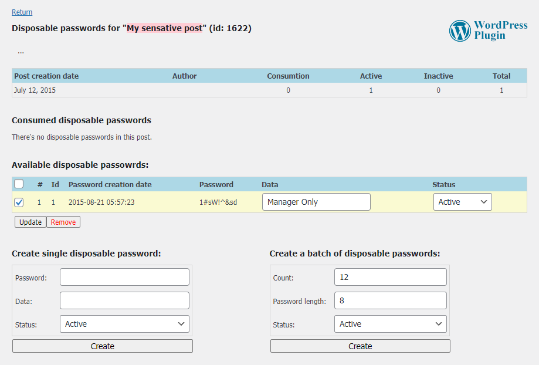

# Disposable Passwords WordPress Plugin
Assign Disposable Passwords on your posts, granting third-parties a one-time access

Disposable passwords are helpful for people who have content that needs only to be viewed once; especially journalists who need their unconfirmed content to be checked by the people involved in their story. Simply copy the `disposable-passwords` folder into the WordPress plugin directory.

All the code is released to Public Domain. Patches and comments are welcome.
It makes me happy to hear if someone finds the algorithms and the implementations useful.

Ehsan Marufi 
August 2015